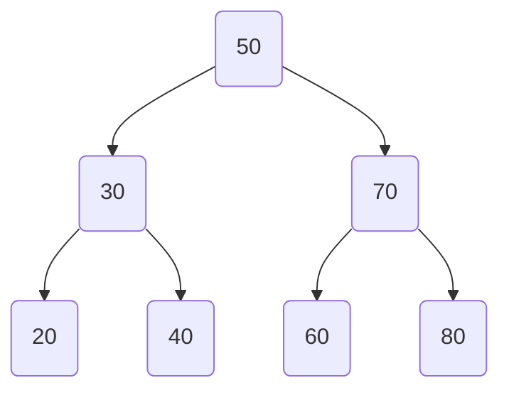

[[Binary Search]] [[tree]] (BST) are a fundamental [[data structure]] that maintains a sorted set of elements and allows for efficient insertion, deletion, and search operations. Each [[node]] in a BST has at most two children, a left child and a right child, following the [[binary search]] property: for any given [[node]], all elements in its left subtree are less than the [[node]], and all elements in its right subtree are greater.

# **Key Points:**

1. **[[Tree]] Structure:** A BST is a hierarchical structure where each [[node]] has, at most, two children. Nodes to the left are smaller, and nodes to the right are larger, adhering to the [[binary search]] property.

2. **Search Operation:** Searching in a BST is efficient. It starts at the [[root]] and compares the target value with the current [[node]]. If the target is smaller, the search continues in the left subtree; if larger, it moves to the right subtree. This process continues until the target is found or the [[tree]] is exhausted.

3. **Insertion:** To insert a new [[node]], start at the [[root]] and compare the value. If the value is smaller, move to the left child; if larger, move to the right child. Repeat this process until an empty spot is found, then insert the new [[node]].

4. **Deletion:** Deleting a [[node]] from a BST involves three cases: a [[node]] with no children (simply remove it), a [[node]] with one child (replace it with the child), and a [[node]] with two children (replace it with its in-order successor or predecessor, then delete the successor/predecessor).

5. **In-Order Traversal:** In-order traversal of a BST results in a sorted sequence. It visits nodes in ascending order (left subtree, current [[node]], right subtree).

6. **Time Complexity:** Average time complexity for search, insertion, and deletion operations in a balanced BST is O(log n), making it efficient for large datasets. However, in the worst case (when the BST is skewed), these operations can degrade to O(n).

7. **Balanced vs. Unbalanced BSTs:** A balanced BST ensures logarithmic height, maintaining efficient operations. Unbalanced BSTs (skewed [[tree]]) can lead to [[performance]] issues. Techniques like [[AVL trees]] and [[Red-Black trees]] are used to keep BSTs balanced.

8. **Applications:** BSTs are used in various applications such as symbol tables, dictionaries, database indexing structures, and in implementing [[algorithms]] like in-order successor/predecessor finding.

9. **Important Operations:** Besides basic operations, mention other essential BST operations like finding minimum/maximum elements, finding the in-order successor/predecessor of a [[node]], and range queries (finding all nodes within a specific range).

Understanding BSTs and their operations is crucial for efficient [[data]] manipulation and retrieval in computer science and programming.
# Example ([[Python]])

**Node Class:**
First, let's create a [[class]] representing a [[node]] in the BST.

```python
class Node:
    def __init__(self, key):
        self.left = None
        self.right = None
        self.val = key
```

**Insertion:**
Here's how you can insert a new [[node]] into a BST.

```python
def insert(root, key):
    if root is None:
        return Node(key)
    else:
        if root.val < key:
            root.right = insert(root.right, key)
        else:
            root.left = insert(root.left, key)
    return root
```

**Search:**
Searching for a value in a BST.

```python
def search(root, key):
    if root is None or root.val == key:
        return root
    if root.val < key:
        return search(root.right, key)
    return search(root.left, key)
```

**In-Order Traversal:**
Performing an in-order traversal to get elements in sorted order.

```python
def in_order_traversal(root):
    if root:
        in_order_traversal(root.left)
        print(root.val)
        in_order_traversal(root.right)
```

**Example Usage:**
Putting it all together.

```python
# Example usage of BST operations
r = Node(50)
r = insert(r, 30)
r = insert(r, 70)
r = insert(r, 20)
r = insert(r, 40)
r = insert(r, 60)
r = insert(r, 80)

# Print in-order traversal (should print sorted values)
print("In-Order Traversal:")
in_order_traversal(r)

# Search for a value in BST
search_key = 40
result = search(r, search_key)
if result:
    print(f"Value {search_key} found in BST.")
else:
    print(f"Value {search_key} not found in BST.")
```

In this example, a BST is created with values 50, 30, 70, 20, 40, 60, and 80. The `in_order_traversal` function prints the values in sorted order. The `search` function is used to search for a specific value (in this case, 40) in the BST.




This is an example of a [[binary search]] [[tree]] with the following structure:

- The [[root]] [[node]] is 50.
- The left subtree of the [[root]] contains nodes 30 and 20.
- The right subtree of the [[root]] contains nodes 70, 60, and 80.
- [[Node]] 40 is a child of [[node]] 30.

Note that this is just an example, and the actual structure of a [[binary search]] [[tree]] can vary depending on the values being inserted.
