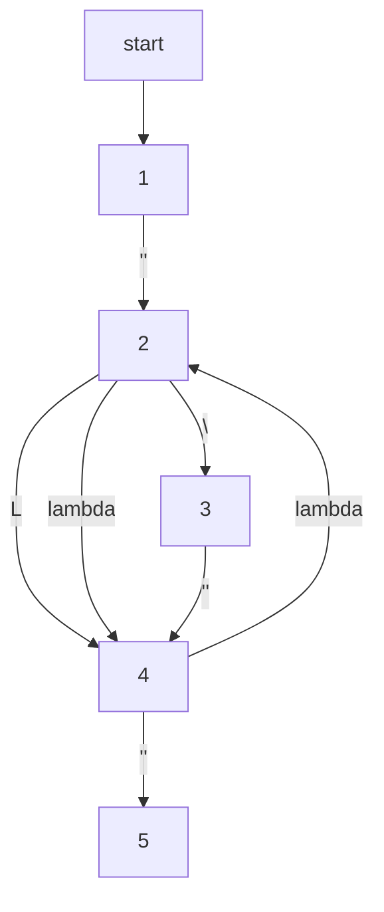
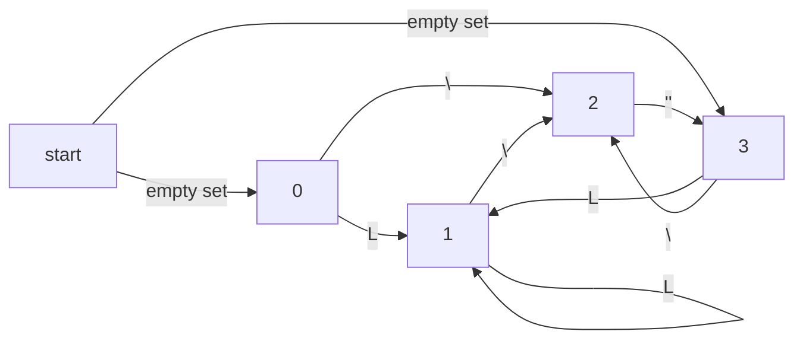
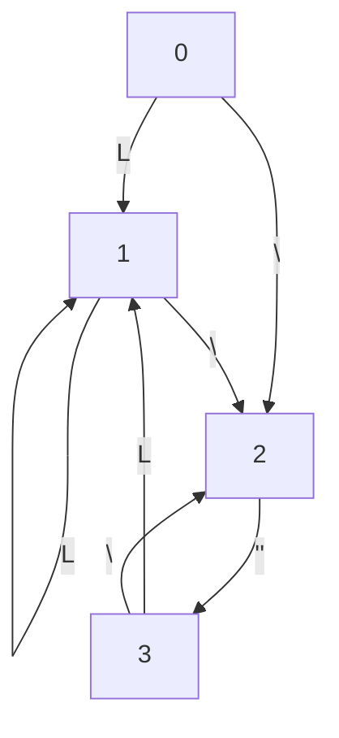

1. (\\''+L)*
2. $\lambda$ NFA

3. NFA

3. transition table:

| States | input L | input \ | input " | input emptyset |
| ------ | ------- | ------- | ------- | -------------- |
| start  |         |         |         | 0 or 3         |
| 0      | 1       | 2       |         |                |
| 1      | 1       | 2       |         |                |
| 2      |         |         | 3       |                |
| 3      | 1       | 2       |         |                |
|        |         |         |         |                |
4. NFA to DFA

4. 
christian mugisha
