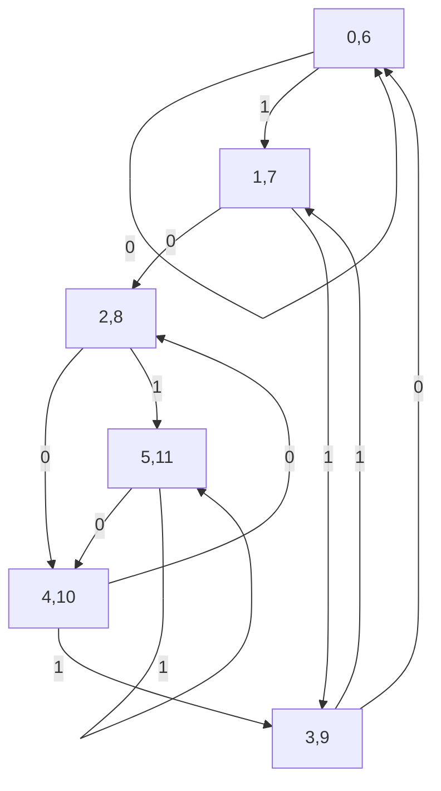
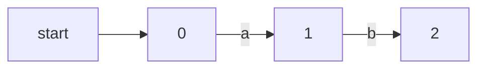
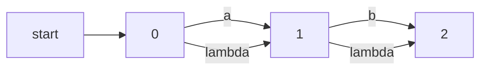

On input 0, the machine goes from state i to state 2i%12. On input 1, the machine goes from state i to state (2i + 1)%12.

| States | Input transition 0 | Input Transition 1 |
| ------ | ------------------ | ------------------ |
| 0      | 0                  | 1                  |
| 1      | 2                  | 3                  |
| 2      | 4                  | 5                  |
| 3      | 6                  | 7                  |
| 4      | 8                  | 9                  |
| 5      | 10                 | 11                 |
| 6      | 0                  | 1                  |
| 7      | 2                  | 3                  |
| 8      | 4                  | 5                  |
| 9      | 6                  | 7                  |
| 10     | 8                  | 9                  |
| 11     | 10                 | 11                 |
6 equivalent states {0,6}{1,7}{2,8}{3,9}{4,10}{5,11}

