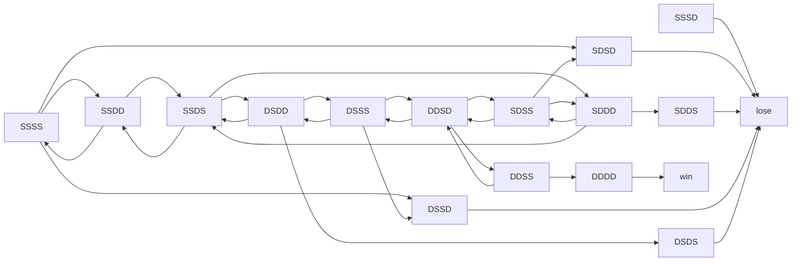

```mermaid
graph LR;
SSSS --> SSDD;
SSSS --> SDSD;
SSSS --> DSSD;
SSSD --> lose;
SSDS --> DSDD;
SSDS --> SDDD;
SSDS --> SSDD;
SSDD --> SSDS;
SSDD --> SSSS;
SDSS --> SDSD;
SDSS --> DDSD;
SDSS --> SDDD;
SDSD --> lose;
SDDS --> lose;
SDDD --> SDDS;
SDDD --> SDSS;
SDDD --> SSDS;
DSSS --> DSSD;
DSSS --> DDSD;
DSSS --> DSDD;
DSSD --> lose;
DSDS --> lose;
DSDD --> DSDS;
DSDD --> SSDS;
DSDD --> DSSS;
DDSS --> DDSD;
DDSS --> DDDD;
DDSD --> SDSS;
DDSD --> DDSS;
DDSD --> DSSS;
DDDD --> win;
```

(C, G, W, B)