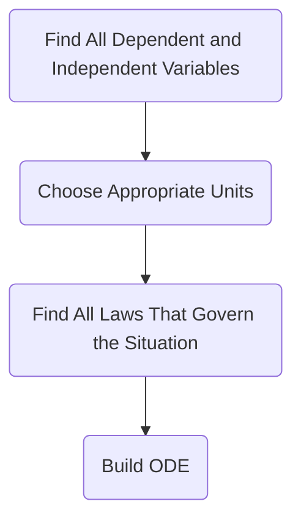

### Function equation
#math
$f(x)=e^x$
[[ODE|Ordinary Differential Equation]]

#### Goal
1. be able to model the target situation (by [[ODE]]
2. analyzing the [[ODE]] qualitatively and quantitatively

