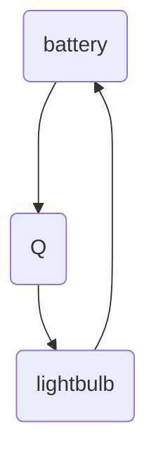

#physics #hardware #computing 
Units in [[Joules]], V
measured across things
[[polarity]]

voltage is like [[potential energy]]
like a ball sitting a the top of a hill

1. voltage always needs a reference
2. voltage is [[path independent]]

[[batteries]]

[[load]] across lightbulb is e
$w=F*e$
$=q(E*e)$ -->V
$=q*V$
in referring to "-", "+" side is $V$ higher $V$ can be positive or negative
# examples

## ex1
1.5 volt battery
10 [[coulomb]] charge total
E dissipated in the bulb
$E=V*q=1.5*10=15$

## ex2
$E=1000J$, $10V$
$i=100mA$, $t?$
convert units to [[SI units]]
$q=\frac{E}{V}=\frac{1000J}{10V}=100C$
$t=\frac{q}{t} = \frac{100c}{10*10^{-3}A}=2.8h$
$q=i*t=10mA*2.8h=28(mA*h)$

## ex3
$375V$ $169MJ$
unit $3.5V$, $2.1Ah$ output
how many unit [[battery]] cells/how are they going to be arranged
N in series
M in parallel
N=$\frac{375V}{3.5V}$
because we know voltage and charge, we therefore know [[energy]]

S$=\frac{169*10^6J}{3.5V*2.1Ah}=6387$
$M=\frac{S}{N}$